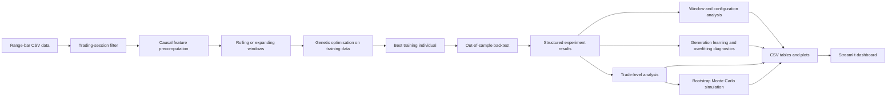
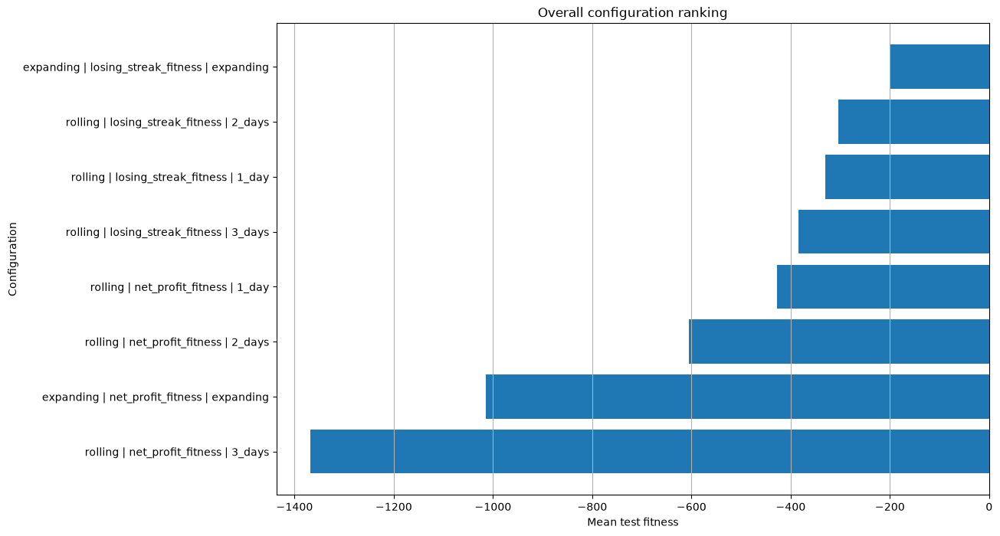
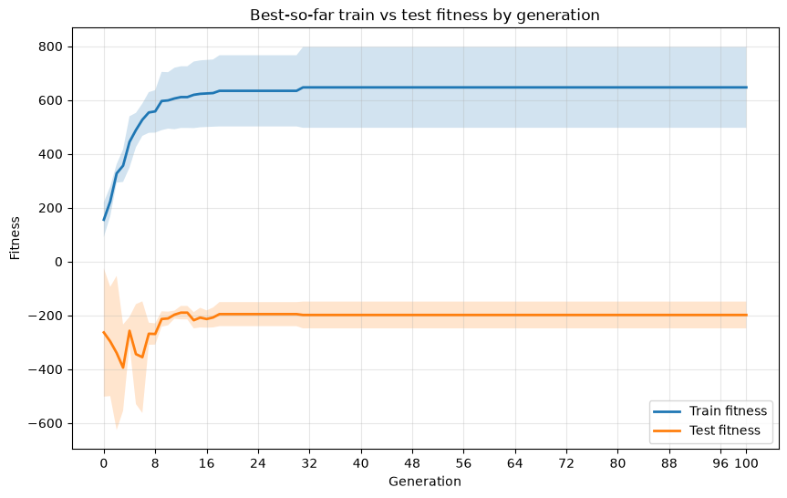
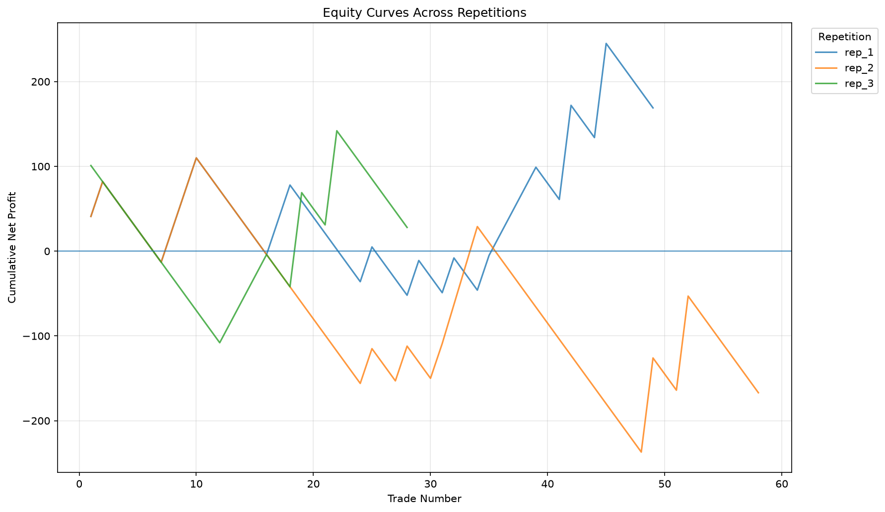
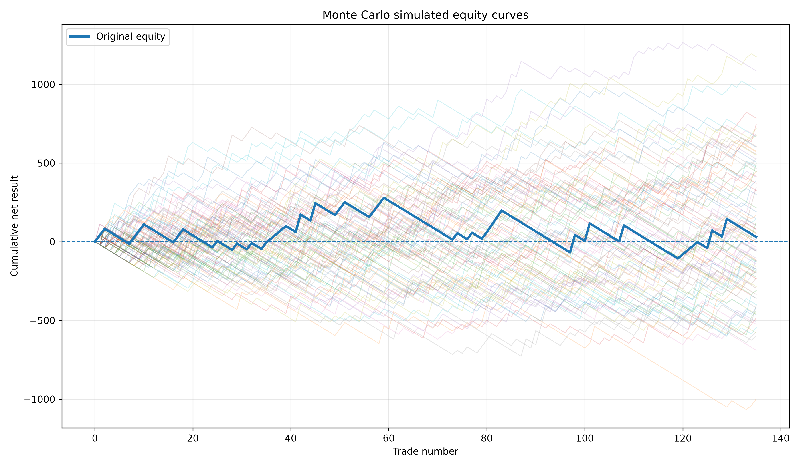
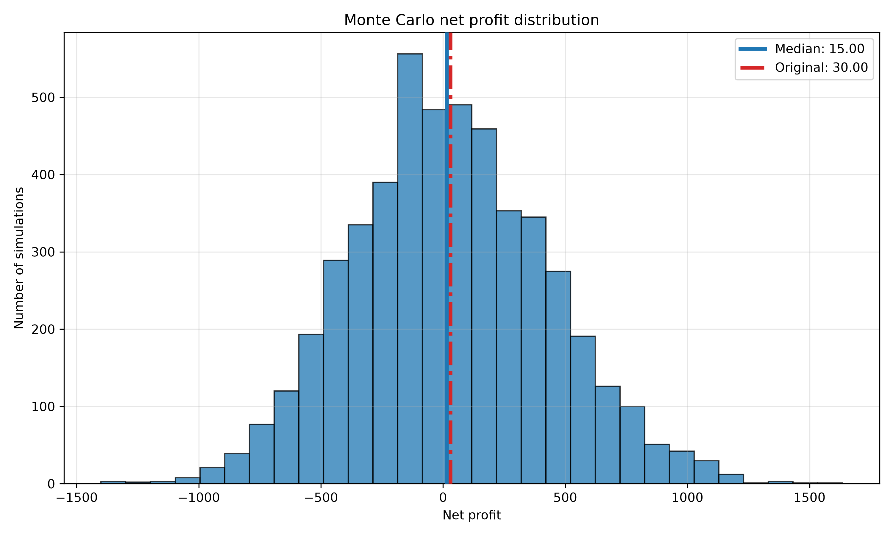

# Evolutionary Walk-Forward Research

**A modular Python research framework for genetic optimisation, walk-forward validation, trade diagnostics, and Monte Carlo robustness analysis of systematic intraday strategies.**

> This project is not presented as evidence of a profitable trading strategy. Its purpose is to build and demonstrate a disciplined quantitative research process that can optimise a strategy, test it out of sample, diagnose overfitting, and report uncertainty.

[](https://www.python.org/)
[](https://streamlit.io/)
[](#limitations)

## Overview

A conventional backtest can look strong because of parameter overfitting, a favourable market period, unrealistic execution assumptions, or random optimiser variance. This repository was built around a different question:

> **Can a complete research workflow make weak or unstable strategy evidence visible before a profitability claim is made?**

The framework currently uses an impulse-based strategy on high frequency Nasdaq-100 E-mini futures (`NQ`) range-bar data as a case study. The strategy itself is replaceable; the main contribution is the reusable research infrastructure around it.

### Main capabilities

- Configuration-driven experiments through Python dataclasses and a Streamlit dashboard.
- Event-driven range-bar feature engineering and intraday session filtering.
- Genetic optimisation with tournament selection, per-gene crossover, bounded mutation, best-so-far tracking, and optional multiprocessing.
- Rolling and expanding day-based walk-forward validation.
- Generation-level learning and train/test generalisation diagnostics.
- Configuration ranking across fitness functions and training-window designs.
- Pooled, repetition-level, directional, window-level, and concentration-based trade analysis.
- Bootstrap Monte Carlo simulation with consistent tick-value and commission conversion.
- Standardised experiment folders containing auditable CSV tables and plots.

## Research workflow



The best individual is selected using **training fitness only**. Test-window evaluations are stored for out-of-sample measurement and post-hoc generalisation diagnostics; they are not used to choose the final individual for a window.

## Case-study strategy

The included strategy searches for short, rapid directional impulses in event-driven range bars. A long signal requires a sequence of upward bars; a short signal requires a sequence of downward bars. The sequence must also satisfy duration and order-flow imbalance conditions.

The genetic algorithm optimises six parameters:

| Parameter | Purpose |
|---|---|
| `min_impulse_candles` | Minimum number of consecutive directional range bars. |
| `max_duration_ms` | Maximum clock-time duration of the impulse. |
| `diagonal_imbalance_ratio_threshold` | Minimum diagonal ask/bid imbalance ratio. |
| `min_imbalance_count` | Minimum qualifying imbalances within the impulse. |
| `take_profit_ticks` | Profit-target distance. |
| `stop_loss_ticks` | Stop-loss distance. |

The strategy combines event-driven bars with an explicit millisecond constraint. This distinguishes a rapid price impulse from the same number of range bars formed slowly.

## Genetic optimisation

Each individual is one complete strategy-parameter vector. The current evolutionary process uses:

- **Tournament selection:** three randomly selected individuals compete to become a parent.
- **Per-gene crossover:** each parameter has a 50% probability of being inherited from the second parent.
- **Bounded local mutation:** one parameter may be adjusted while respecting valid parameter limits.
- **Best-so-far tracking:** the strongest training individual observed across generations is retained separately and used for final out-of-sample evaluation.
- **Patience-based stopping:** optimisation can stop after a configurable number of generations without training-fitness improvement.
- **Optional parallel evaluation:** individuals can be evaluated across multiple CPU processes.

### Available fitness functions

Let `P` be net profit after costs, `N` the number of trades, `DD` maximum drawdown, and `L` the longest losing streak.

| Fitness function | Objective |
|---|---|
| `net_profit_fitness` | Maximise `P`. |
| `expectancy_fitness` | Maximise average net result per trade. |
| `drawdown_adjusted_fitness` | Maximise `P × sqrt(N) / max(1, DD)`. |
| `losing_streak_fitness` | Maximise `P × sqrt(N) / max(1, L)`. |
| `robust_fitness` | Penalise profit using normalised drawdown and losing-streak risk. |

Risk-adjusted objectives apply a minimum-trade rule to discourage sparse solutions. For cross-window comparison, test fitness is normalised using the ratio of training days to test days where appropriate. Reported test fitness is therefore a model-selection diagnostic and should not be confused with monetary P&L.

## Walk-forward validation

The framework supports two validation designs:

### Expanding window

The training sample always starts at the beginning of the dataset and grows as the test period moves forward.

```text
Train 1  -> Test 1
Train 1 + Test 1  -> Test 2
Train 1 + Test 1 + Test 2  -> Test 3
```

### Rolling window

The training sample keeps a fixed length and moves forward with the test period.

```text
Train 1  -> Test 1
          Train 2  -> Test 2
                    Train 3  -> Test 3
```

Windows are created from unique trading days rather than fixed row counts. This is important for event-driven data because each day can contain a different number of range bars.

## Backtesting and execution assumptions

The current backtester processes one position at a time and prevents overlapping trades by moving to the bar after the previous exit.

| Assumption | Current implementation |
|---|---|
| Instrument tick size | `0.25` index points, currently hardcoded for NQ. |
| Entry slippage | One tick in the unfavourable direction. |
| Take-profit execution | Limit-order fill with no additional exit slippage. |
| Stop-loss execution | One additional tick of adverse exit slippage. |
| Maximum holding period | Configurable number of range bars. |
| Same-bar TP/SL ambiguity | Stop loss is checked first, producing the conservative outcome. |
| Monetary conversion | `trade result in ticks × tick value − commission`. |

In the included experiment, tick value was `$5` and commission was `$4` per completed trade. The same cost conversion was used during optimisation, trade analysis, and Monte Carlo analysis.

The time filter does not perform timezone conversion. Input timestamps must already be expressed in the intended session timezone.

## Analysis modules

### 1. Window and configuration analysis

Compares walk-forward types, fitness functions, rolling train lengths, test fitness, net profit, drawdown, win rate, expectancy, and trade count. It also creates configuration rankings and profit-versus-drawdown plots.

### 2. Generation learning and generalisation

Stores population best, average, median, dispersion, and fitness range for every generation. Best-so-far train and test fitness are aligned by generation to analyse whether training improvement transfers out of sample.

The current overfitting flag is a transparent heuristic. It is triggered when:

1. training fitness improves;
2. test fitness does not improve; and
3. the train-test generalisation gap increases.

### 3. Trade analysis

Produces pooled, repetition-level, and window-level statistics, including:

- net profit, profit factor, expectancy, and win rate;
- drawdown, recovery factor, and streak lengths;
- long-versus-short decomposition;
- top-trade profit concentration;
- distribution skewness and kurtosis;
- stability across walk-forward windows and stochastic repetitions.

### 4. Monte Carlo robustness analysis

The Monte Carlo module draws complete trade outcomes **with replacement** from the selected out-of-sample trade sample. Each simulated path contains the same number of trades as the original sample, but its order and composition can differ.

This estimates conditional sampling and path uncertainty. It does **not** test whether the strategy has true predictive power, reproduce the optimisation process, model new market regimes, or preserve serial dependence between trades.

## Included NQ five-day development experiment

The repository includes the generated outputs from a deliberately small development experiment.

| Setting | Value |
|---|---|
| Instrument | Nasdaq-100 E-mini futures (`NQ`) |
| Data representation | 4-tick range bars, equivalent to one NQ index point |
| Development sample | Five trading days |
| Active session | 14:30–17:30; source data already expressed in the intended timezone |
| Fitness functions compared | Net profit and losing-streak fitness |
| Walk-forward designs | Expanding; rolling with 1-, 2-, and 3-day training samples |
| Stochastic repetitions | 3 per configuration |
| Generations stored | Generation 0 through 100 |
| Configurations | 8 |
| Optimisation runs | 24 |
| Out-of-sample window sequences | 78 |
| Monte Carlo simulations | 5,000 with seed 42 |
| Generated evidence | 297 CSV files and 123 plots |

### Main empirical result

The highest-ranked configuration was **expanding walk-forward with losing-streak fitness**. Its three pooled out-of-sample repetitions produced:

| Metric | Result |
|---|---:|
| Trades | 135 |
| Net profit after commission and slippage | `$30` |
| Profit factor | `1.016` |
| Win rate | `27.41%` |
| Expectancy per trade | `$0.22` |
| Maximum drawdown | `$385` |
| Recovery factor | `0.078` |
| Longest losing streak | `14` |

The repetitions were materially different:

| Repetition | Trades | Net profit | Profit factor | Maximum drawdown |
|---|---:|---:|---:|---:|
| `rep_1` | 49 | `$169` | `1.28` | `$162` |
| `rep_2` | 58 | `−$167` | `0.80` | `$347` |
| `rep_3` | 28 | `$28` | `1.07` | `$209` |

Across all configurations, the optimiser improved its training objective in `75 / 78` window sequences, while the heuristic overfitting diagnostic flagged `47 / 78`. The median selected generation was `9`, even though results were stored through generation `100`.

> **Interpretation:** the optimiser usually learned on the training sample, but the improvement frequently failed to transfer to unseen data.

### Configuration comparison



The losing-streak objective occupied the first four ranks by reported test fitness. This ranking still contains window-size normalisation and low-trade penalties, so economic metrics must be inspected separately.

### Training versus out-of-sample fitness



Training fitness rose rapidly, while mean test fitness remained negative and unstable. This is the central generalisation result of the experiment.

### Repetition instability



The same configuration produced one positive repetition, one negative repetition, and one approximately flat repetition. The small pooled profit should therefore not be interpreted independently of optimiser variance.

### Monte Carlo result

The 5,000 bootstrap simulations produced:

| Metric | Original | Median | 5th percentile | 95th percentile |
|---|---:|---:|---:|---:|
| Net profit | `$30` | `$15` | `−$605` | `$715` |
| Maximum drawdown | `$385` | `$412` | `$210` | `$798` |
| Profit factor | `1.016` | `1.008` | `0.698` | `1.415` |
| Win rate | `27.41%` | `27.41%` | `21.48%` | `34.07%` |
| Longest losing streak | `14` | `12` | `8` | `20` |

`2,433 / 5,000` simulations, or `48.66%`, finished below zero. In `56.36%` of simulations, maximum drawdown exceeded the original `$385` drawdown.

<p align="center">
  
  
</p>

> The original result lies close to the centre of a very wide distribution. The appropriate conclusion is strategy fragility, not persistent alpha.

## Streamlit dashboard

`app.py` provides a single interface for the complete workflow:

1. **Backtester Parameters** — select data, sessions, fitness functions, GA settings, walk-forward methods, and multiprocessing options.
2. **Evolution Analysis** — run and browse window, generation, and overfitting diagnostics.
3. **Trade Analysis** — select exact configurations and repetitions, then inspect tables and plots.
4. **Monte Carlo Simulation** — aggregate selected repetitions, configure simulations, and browse output distributions.

The dashboard discovers available experiments, configurations, and repetitions from the repository's folder structure rather than requiring hardcoded result paths.

## Repository structure

```text
.
├── app.py                              # Streamlit research dashboard
├── core/
│   ├── config/                         # Dataclass experiment configurations
│   ├── runners/                        # Backtest and analysis orchestration
│   └── results_managers/               # Folder discovery, loading, and saving
├── data/
│   ├── helpers/                        # CSV loading and session filtering
│   └── market_data/                    # Sample schema and local market data
├── src/
│   ├── fitness/                        # Metrics, objectives, and parallel evaluation
│   ├── ga/                             # Selection, crossover, mutation, evolution
│   ├── strategies/impulse_strategy/    # Feature and signal generation
│   └── trading/
│       ├── backtester.py               # Trade execution engine
│       └── walk_forward/               # Window creation and validation loop
├── analysis/
│   ├── general_analysis/               # Configuration, generation, and overfit analysis
│   └── trade_analysis/                 # Performance, risk, robustness, and plots
├── monte_carlo/                        # Bootstrap engine, metrics, summaries, and plots
├── experiments/NQ-5D/                  # Included experiment results and diagnostics
├── tests/                              # Deterministic fixtures and development checks
└── Report.docx                         # Full project report
```

## Getting started

### Requirements

- Python `3.10+`
- NumPy
- pandas
- Matplotlib
- Streamlit

Dependency versions are not yet pinned in the repository.

### Installation

```bash
git clone https://github.com/AlexandreKupfermunz/evolutionary-backtesting.git
cd evolutionary-backtesting

python -m venv .venv
```

Activate the environment:

```bash
# macOS / Linux
source .venv/bin/activate

# Windows PowerShell
.venv\Scripts\Activate.ps1
```

Install the current dependencies:

```bash
python -m pip install --upgrade pip
pip install numpy pandas matplotlib streamlit
```

Launch the dashboard:

```bash
streamlit run app.py
```

## Market-data input

The full research dataset is intentionally excluded from version control. `data/market_data/NQ-Sample_Data.txt` demonstrates the expected format:

```text
Date, Time, Open, High, Low, Last, Volume, NumberOfTrades, BidVolume, AskVolume
2026/6/15, 00:00:00.142, 30200.00, 30201.00, 30200.00, 30200.00, 3, 3, 2, 1
```

Required columns used by the current pipeline are:

```text
Date
Time
High
Low
Last
BidVolume
AskVolume
```

Place a compatible file in `data/market_data/`, then select its path in the dashboard. The complete `NQ-5D.txt` and `NQ-1Y.txt` files are excluded through `.gitignore`.

## Programmatic use

The dashboard is optional. A backtest can also be configured directly in Python:

```python
from datetime import time
from pathlib import Path

from core.config.backtest_config import BacktestConfig
from core.runners.backtest_runner import run_backtest_from_config

config = BacktestConfig(
    experiment_folder=Path("experiments/my_experiment"),
    data_path="data/market_data/NQ-5D.txt",
    trade_windows=[(time(14, 30), time(17, 30))],
    fitness_function_names=[
        "losing_streak_fitness",
        "net_profit_fitness",
    ],
    run_expanding=True,
    run_rolling=True,
    number_of_generations=100,
    population_size=100,
    patience=25,
    number_of_iterations=3,
    maximum_holding_bars=100,
    tick_value=5.0,
    commission=4.0,
    use_parallel=False,
    n_jobs=6,
    test_days=1,
    expanding_initial_train_days=2,
    expanding_step_days=1,
    rolling_step_days=1,
    train_sizes={
        "1_day": 1,
        "2_days": 2,
        "3_days": 3,
    },
)

run_backtest_from_config(config)
```

## Experiment outputs

Each run creates a deterministic folder hierarchy based on validation method, fitness function, rolling train size, and repetition.

```text
experiments/<experiment_name>/
├── results/
│   ├── expanding/<fitness>/rep_<n>/
│   └── rolling/<fitness>/<train_size>/rep_<n>/
└── analysis_output/
    ├── local_generation_analysis/
    ├── global_generation_analysis/
    ├── window_analysis/
    ├── trade_analysis/
    └── monte_carlo/
```

A repetition stores:

- `walk_forward_results.csv` — selected parameters and out-of-sample metrics by window;
- `walk_forward_trades.csv` — complete out-of-sample trade records;
- `generation_results.csv` — population statistics for every generation;
- `generation_best_individuals.csv` — train and test metrics for each generation's best individual.

Analysis modules add aggregated tables and plots without modifying the original optimisation files.

## Limitations

This repository should be interpreted as research infrastructure, not a production trading system.

### Statistical limitations

- The included experiment uses only five trading days and a single market.
- Eight configurations were compared on the same development sample.
- There is no nested model-selection layer or untouched final test period.
- Only three stochastic GA repetitions were used.
- The GA random state is not yet persisted in an experiment manifest.
- The Monte Carlo bootstrap treats observed trades as independently resampleable and is conditional on the selected strategy and sample.
- The bootstrap does not include model-selection, optimiser, regime, liquidity, or market-impact uncertainty.

### Engineering and execution limitations

- NQ tick size and fixed slippage rules are currently hardcoded in the backtester.
- The backtester does not model queue position, partial fills, variable spread, or market impact.
- Feature computation is designed to be causal, but formal leakage and boundary tests should be expanded.
- The experiment archive does not yet contain a complete manifest with dataset checksum, contract month, bar-construction settings, software environment, and Git commit hash.
- Dependency versions are not pinned.
- The current `tests/` folder contains useful development fixtures, but it is not yet a clean CI-ready automated test suite.
- There is no broker connection or live-trading component.

## Roadmap

### Quantitative research

- Run multi-year datasets containing different volatility and liquidity regimes.
- Add train, validation, and untouched final-test layers.
- Increase the number of GA seeds and report full optimiser distributions.
- Add transaction-cost and slippage sensitivity analysis.
- Compare the strategy with random, buy-and-hold, and placebo-signal baselines.
- Add block bootstrap or regime-aware resampling to preserve more temporal dependence.
- Re-run the complete optimisation process inside outer resampling loops.

### Software engineering

- Move execution assumptions into a dedicated configuration object.
- Add a complete experiment manifest and deterministic GA seeding.
- Add `pyproject.toml` or a pinned requirements file.
- Convert development checks into a structured `pytest` suite with continuous integration.
- Add checkpoints and resume support for long experiments.
- Profile expensive functions and evaluate NumPy, Numba, or compiled alternatives.
- Improve multiprocessing portability and structured logging.

## What this project demonstrates

- Modular Python software design for quantitative research.
- Evolutionary optimisation and stochastic-search diagnostics.
- Time-series validation with rolling and expanding windows.
- Transaction-cost-aware backtesting.
- Statistical analysis of generalisation, risk, and result concentration.
- Monte Carlo simulation and uncertainty reporting.
- Reproducible folder and output management.
- Critical interpretation of weak or inconclusive results.

## Report

A full portfolio report describing the design, experiment, diagnostics, results, and limitations is included in [`Report.pdf`](Report.pdf).

## Disclaimer

This repository is an educational quantitative-research project. It is not financial advice, investment research, or a recommendation to trade futures. Historical simulations and resampled outcomes do not guarantee future performance.

---

**Alexandre Kupfermunz**  
Quantitative research portfolio project · June-July 2026